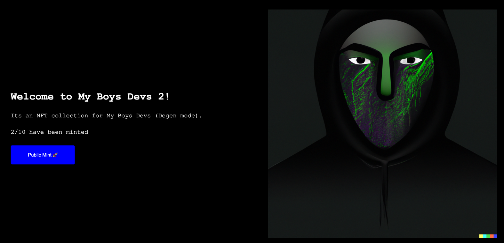

# My Boys Devs2 NFT collection 
##(degen version with IPFS)

```
1)
npm init --yes
npm install --save-dev hardhat @nomicfoundation/hardhat-toolbox

2)
npx hardhat

3)
npm install @openzeppelin/contracts

4)
npx hardhat compile

5)
correct .env

6)
npm install dotenv

7)
npx hardhat run scripts/deploy.js --network mumbai
```

###Result: 
Polygon network
- My Boys Devs2 (MBD2) NFT collection address `0xf04ecC8BaD70C3DbFfc1CE69B521B35F6766e6A8`
- OpeanSea: https://testnets.opensea.io/collection/myboysdevs
- MBD Collection Dapp: (not deployed -> https://github.com/GorniyGor/deploy-ipfs-nft-dapp.git)

- Account with minted nft `0x3f49956578E5738B1963F4e2CFD76B6362488Ea3`

