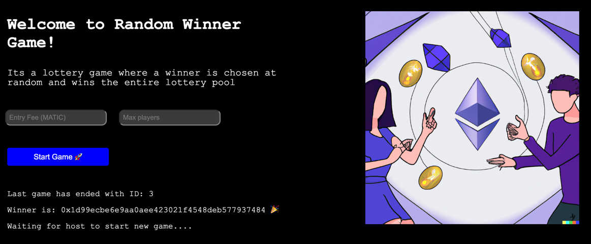

# Lottery (with VRF)

```
1)
deploy Lottery contract on Polygon:Mumbai
and verify

2)
play at least 1 game through Polygonscan

2)
create The Graph subgraph that's watching your events

3)
deploy dApp
```

###Result: 
Polygon network
- Lottery contract address `0x3451d98f23c35C1D0D9e03056d16B0AC6d43bFb8`
- Lottery Dapp: https://lottery-gorniygor.vercel.app

- Participant account `0x3f49956578E5738B1963F4e2CFD76B6362488Ea3`
- `The Graph` subgraph endpoints: https://api.thegraph.com/subgraphs/name/gorniygor/learnweb3


