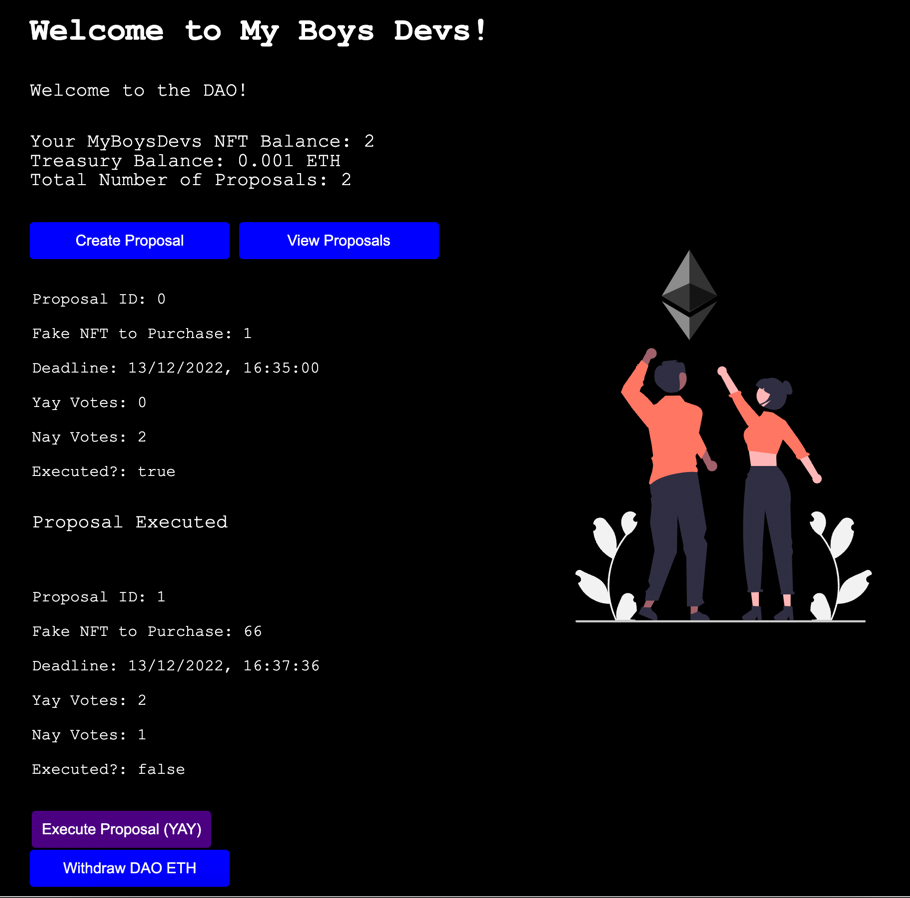

# Initial Coin Offering (ICO)

```
1)
npm init --yes
npm install --save-dev hardhat @nomicfoundation/hardhat-toolbox

2)
npx hardhat

3)
npm install @openzeppelin/contracts

4)
npx hardhat compile

5)
correct .env

6)
npm install dotenv

7)
npx hardhat run scripts/deploy.js --network goerli
```

###Result:
- My Boys Devs (MBD) DAO address `0x0c92fCD5B1188Db2b914E8c46dA5a5383cBfC358`
- Account with proposal transaction `0x3f49956578E5738B1963F4e2CFD76B6362488Ea3`
- MBD DAO Dapp: (not deployed -> https://github.com/GorniyGor/deploy-mbd-dao-dapp.git)

- Used fake nft marketplace `0x58c8995c3b4026feF4DaD92A056EBb964e38Bf64`

