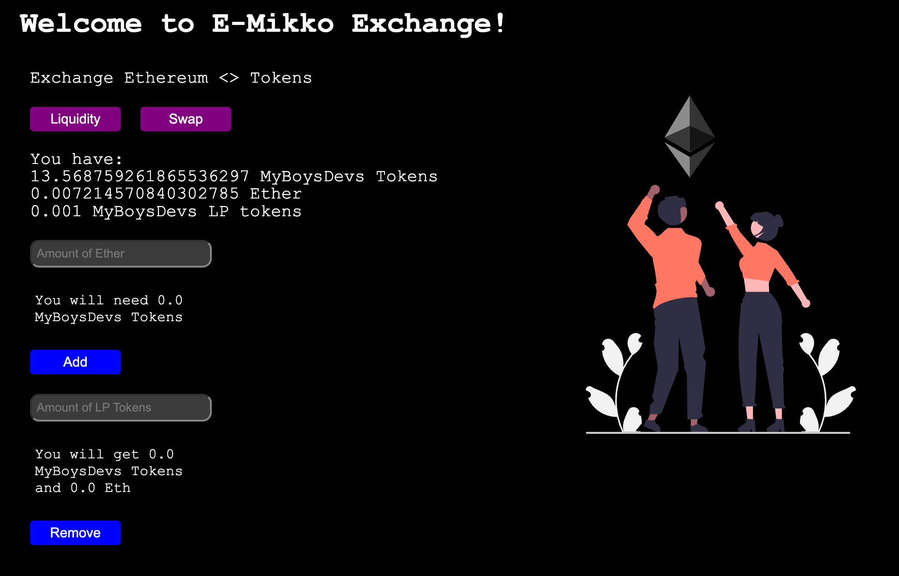
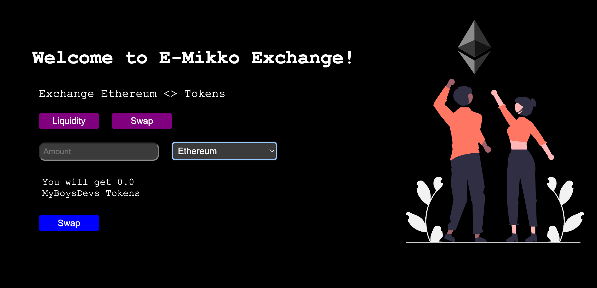

# Initial Coin Offering (ICO)

```
1)
npm init --yes
npm install --save-dev hardhat @nomicfoundation/hardhat-toolbox

2)
npx hardhat

3)
npm install @openzeppelin/contracts

4)
npx hardhat compile

5)
correct .env

6)
npm install dotenv

7)
npx hardhat run scripts/deploy.js --network goerli
```

###Result:
- DEX address `0xA60f6106f9eD058444e2c712BF5c905ea001FaCe`
- Account with dex interaction `0x3f49956578E5738B1963F4e2CFD76B6362488Ea3`
- E-Mikko DEX Dapp: https://dex-dapp-gorniygor.vercel.app/


