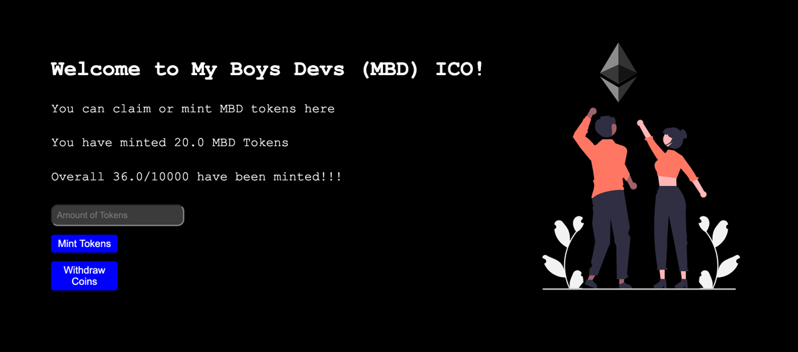

# Initial Coin Offering (ICO)

```
1)
npm init --yes
npm install --save-dev hardhat @nomicfoundation/hardhat-toolbox

2)
npx hardhat

3)
npm install @openzeppelin/contracts

4)
npx hardhat compile

5)
correct .env

6)
npm install dotenv

7)
npx hardhat run scripts/deploy.js --network goerli
```

###Result:
- My Boys Devs (MBD) coin address `0xa249e22859d804C6332843e9cF91d7d695b244Be`
- Account with minted token `0x3f49956578E5738B1963F4e2CFD76B6362488Ea3`
- MBD Collection Dapp: (not deployed -> https://github.com/GorniyGor/deploy-mbd-ico-dapp.git)


