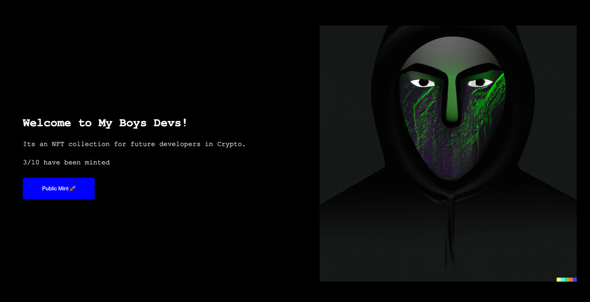

# My Boys Devs NFT collection

```
1)
npm init --yes
npm install --save-dev hardhat @nomicfoundation/hardhat-toolbox

2)
npx hardhat

3)
npm install @openzeppelin/contracts

4)
npx hardhat compile

5)
correct .env

6)
npm install dotenv

7)
npx hardhat run scripts/deploy.js --network goerli
```

###Result: 
- My Boys Devs (MBD) NFT collection address `0x45Aa46F307820BC71fD92cF7A89b97e05F53098f`
- MBD Collection Dapp: https://mbd-nft-collection-gorniygor.vercel.app
  
- OpeanSea: https://testnets.opensea.io/collection/my-boys-devs
- Account with minted nft `0x3f49956578E5738B1963F4e2CFD76B6362488Ea3`
Dapp code https://github.com/GorniyGor/deploy-mbd-nft-collection-dapp.git

